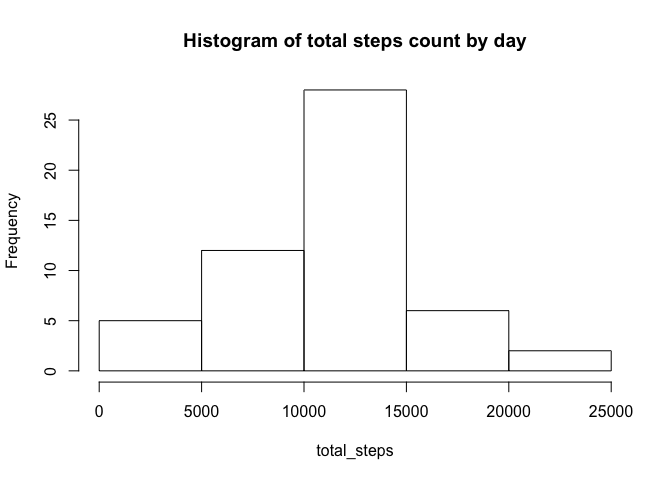
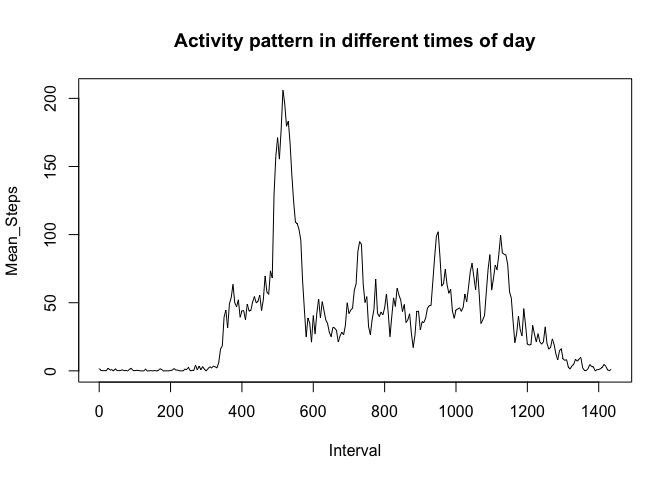
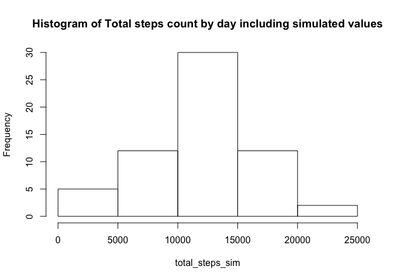
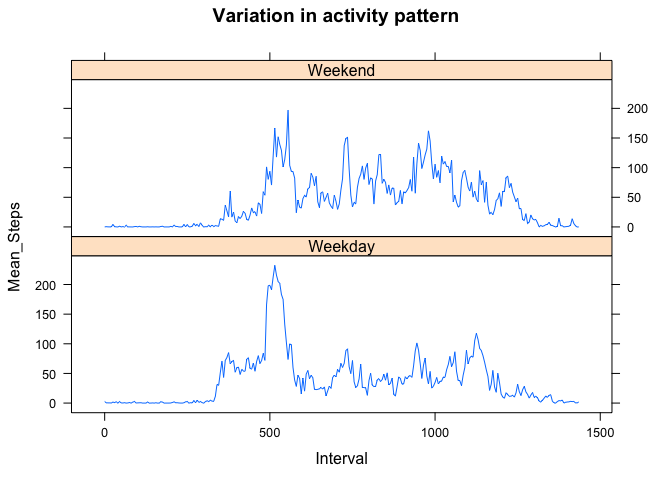

# Reproducible Research: Peer Assessment 1

# Introduction

This analysis explores a dataset on personal movement gathered through a personal avtivity monitoring device. This device collects data at 5 minute intervals through out the day. The data consists of two months of data from an anonymous individual collected during the months of October and November, 2012 and include the number of steps taken in 5 minute intervals each day.

The variables included in this dataset are:
 - steps: Number of steps taking in a 5-minute interval (missing values are coded as  NA )
 - date: The date on which the measurement was taken in YYYY-MM-DD format
 - interval: Identifier for the 5-minute interval in which measurement was taken

The dataset is stored in a comma-separated-value (CSV) file and there are a total of 17,568 observations in this dataset.

## Objectives

Objectives of this analysis are as follows:
 - Display steps in loading and preprocessing the data
 - Display steps to perform exploratory analysis
 - Show certain key charateristics of the dataset depicting:
    >> Shape, centrality and spread of activity in terms of steps count
    >> Daily activity pattern averaged over all days on 5 minutes intervals
 - Deal with missing values through by imputing and simulating new values to fill in
 - Study differences in activity patterns between Weekdays and Weekends 


## Loading and preprocessing the data

The source file is downloaded and loaded into a data frame using "read.csv". We explore some general characteristics in the data such as - presence of missing values in different columns, data types, whether all dates are present, and each date has equal number of data points (5 minute intervals), add a date-time field etc. This analysis explores a dataset on personal movement gathered through a personal avtivity monitoring device. 


```r
activity<-read.csv("activity.csv",stringsAsFactors=FALSE)
```

Next we perform certain initial exploratory analysis on the data  such as - presence of missing values in different columns, data types, whether all dates are present. We would notice that the interval field is not a regular progression of 5 minutes, while going from one hour to the other, but it is an encoded value of "hhmm".

```r
#############  Block 1  #############################
##Show Summary of observations
str(activity)
```

```
## 'data.frame':	17568 obs. of  3 variables:
##  $ steps   : int  NA NA NA NA NA NA NA NA NA NA ...
##  $ date    : chr  "2012-10-01" "2012-10-01" "2012-10-01" "2012-10-01" ...
##  $ interval: int  0 5 10 15 20 25 30 35 40 45 ...
```

```r
##Whether columns other than have missing values
##column: date
any(is.na(activity$date))
```

```
## [1] FALSE
```

```r
##column: interval
any(is.na(activity$interval))
```

```
## [1] FALSE
```

```r
##Display progression of interval in dataset
head(table(activity$interval),15)
```

```
## 
##   0   5  10  15  20  25  30  35  40  45  50  55 100 105 110 
##  61  61  61  61  61  61  61  61  61  61  61  61  61  61  61
```
So we split the interval into hours and seconds, and build a comprehensive data frame that would have the DateTime field, and a Time field to denote just the hour and minutes parts.   

We'll take the help of "lubridate" package.We see that there are no missing values for the date and interval fields.  
Then we will construct a dataset excluding 'NA' values.

```r
#############  Block 2  #############################
##Split interval into hours and minutes
##Since interval has a varying number of digits from 0 to 4, we add 10000 with it...
##to find relevant digits. This way interval = 105 becomes hh="01" and mm="05"
##We'll transform the interval in pure progression of minutes
hh<-substr(10000+activity$interval,2,3)
mm<-substr(10000+activity$interval,4,5)
activity$interval<-as.numeric(hh)*60+as.numeric(mm)
## Build the comprehensive dataset inserting a DateTime field and an HHMM field.
library("lubridate")
DateTime<-ymd(activity$date)+hours(as.numeric(hh))+minutes(as.numeric(mm))
HHMM<-paste(hh,mm,"00",sep=":")
activity<-cbind(DateTime,HHMM,activity)

##Remove data with NA
act_wo_NA<-activity[!is.na(activity$steps),]

##Observe few rows
act_wo_NA[10:15,]
```

```
##                DateTime     HHMM steps       date interval
## 298 2012-10-02 00:45:00 00:45:00     0 2012-10-02       45
## 299 2012-10-02 00:50:00 00:50:00     0 2012-10-02       50
## 300 2012-10-02 00:55:00 00:55:00     0 2012-10-02       55
## 301 2012-10-02 01:00:00 01:00:00     0 2012-10-02       60
## 302 2012-10-02 01:05:00 01:05:00     0 2012-10-02       65
## 303 2012-10-02 01:10:00 01:10:00     0 2012-10-02       70
```
## What is mean total number of steps taken per day?

The next step is to provide a **day-wise total for steps**, draw a **histogram** chart on **total number of steps taken each day** and provide **mean** and **median** of total steps per day.


```r
#############  Block 3  #############################
##Calculate total number of steps per day
total_steps<-with(act_wo_NA,tapply(steps,date,sum))

tblHist<-hist(total_steps,plot=FALSE)

intervals<-paste(
                  as.character(tblHist$breaks[1:(length(tblHist$breaks)-1)]),"-",
                  as.character(tblHist$breaks[2:(length(tblHist$breaks))]),sep=" "
                )

##Display data-set
data.frame("Interval" = intervals, "Frequency" = tblHist$counts)
```

```
##        Interval Frequency
## 1      0 - 5000         5
## 2  5000 - 10000        12
## 3 10000 - 15000        28
## 4 15000 - 20000         6
## 5 20000 - 25000         2
```

```r
## Plot histogram
hist(total_steps,main ="Histogram of total steps count by day")
```

 

```r
## Mean of total steps per day
mean(total_steps)
```

```
## [1] 10766.19
```

```r
## Median of total steps per day
median(total_steps)
```

```
## [1] 10765
```
## What is the average daily activity pattern? 

Now we determine the daily activity pattern. For that we will create a time series plot of the average number of steps across the days taken over the 5-minute intervals.  


```r
#############  Block 4  #############################
mean_steps<-with(act_wo_NA,tapply(steps,interval,mean))
act_pattern<-data.frame("Interval" = as.numeric(names(mean_steps)),"Mean_Steps" = as.numeric(mean_steps))  
with(act_pattern,plot(Interval,Mean_Steps,type="l",main="Activity pattern in different times of day"))
```

 

## Imputing missing values
First we find out total number of missing values. Next, we take a quick look into dates with no steps recorded (coded as 'NA'). Also, we check whether those dates with missing values have **all** 288 observations missed out or not. 


```r
#############  Block 5  #############################
num_missing<-sum(is.na(activity$steps))
num_missing
```

```
## [1] 2304
```

```r
##Days with missing values
days<-unique(activity[is.na(activity$steps),4])
data.frame("NA_Days"=days,"DayOfWeek"=weekdays(ymd(days)))
```

```
##      NA_Days DayOfWeek
## 1 2012-10-01    Monday
## 2 2012-10-08    Monday
## 3 2012-11-01  Thursday
## 4 2012-11-04    Sunday
## 5 2012-11-09    Friday
## 6 2012-11-10  Saturday
## 7 2012-11-14 Wednesday
## 8 2012-11-30    Friday
```

```r
#Do these days have all 288 intervals reported as NA? 
#If not, then the following should be strictly less than 288.
sum(is.na(activity$steps))/length(days)
```

```
## [1] 288
```

####Simulation strategy to fill in missing values  
From the activity pattern dataset, we'll figure out what are the mean and SD at each 5 minute interval. Then we'll draw samples from random normal distributions with means and standard deviations matching the mean and sd for that particular interval.  
After plugging the simulated values in, we want to make sure that there are no "NA"s left, and do a quick visual comparison among a previously unrecorded day's simulated dataset with another day's dataset for same intervals.

```r
#############  Block 6  #############################
##Mean and SD of # steps for the intervals
mean_steps<-with(act_wo_NA,tapply(steps,interval,mean))
sd_steps<-with(act_wo_NA,tapply(steps,interval,sd))
distr<-cbind(interval=as.integer(names(mean_steps)),mean_steps,sd_steps)

##Setting a particular seed for reproducibility of the random samples drawn from 
##a standard normal distribution
set.seed(1234)
z<-rnorm(num_missing)

##New activity dataset, where we add simulated values
activity_sim<-activity
##Add simulated values where steps data weren't recorded
d<-0
for(aday in days)
{
      for(intvl in 0:287)
      {
        #sample_data = max(0,mean[interval] + z[day,interval] * sd[interval])
        #setting 0 replacing negative values
        temp<-ceiling(distr[intvl+1,2]+z[d*288+intvl+1]*distr[intvl+1,3])
        activity_sim[
          which(activity_sim$date == aday & activity_sim$interval == 5*intvl)
        ,3]<-ifelse(temp>=0,temp,0)
      }

  d<-d+1
}
##Look for any "NA"s left...
any(is.na(activity_sim$steps))
```

```
## [1] FALSE
```

```r
#Side by side visual comparison between 1/11 (had all steps values missing) and 2/11
# rows for 1/11 from 8 AM to 9 AM 
start1<-which(activity_sim$date=="2012-11-01" & activity_sim$interval==8*60)
finish1<-which(activity_sim$date=="2012-11-01" & activity_sim$interval==9*60)

# rows for 2/11 from 8 AM to 10 AM
start2<-which(activity_sim$date=="2012-11-02" & activity_sim$interval==8*60)
finish2<-which(activity_sim$date=="2012-11-02" & activity_sim$interval==9*60)

##Show comparison
cbind(activity_sim[start1:finish1,c("DateTime","steps")]
      ,activity_sim[start2:finish2,c("DateTime","steps")])
```

```
##                 DateTime steps            DateTime steps
## 9025 2012-11-01 08:00:00     0 2012-11-02 08:00:00   138
## 9026 2012-11-01 08:05:00     7 2012-11-02 08:05:00    95
## 9027 2012-11-01 08:10:00    48 2012-11-02 08:10:00   556
## 9028 2012-11-01 08:15:00   209 2012-11-02 08:15:00   753
## 9029 2012-11-01 08:20:00    83 2012-11-02 08:20:00   747
## 9030 2012-11-01 08:25:00   357 2012-11-02 08:25:00   731
## 9031 2012-11-01 08:30:00   105 2012-11-02 08:30:00   748
## 9032 2012-11-01 08:35:00     0 2012-11-02 08:35:00   708
## 9033 2012-11-01 08:40:00   171 2012-11-02 08:40:00   377
## 9034 2012-11-01 08:45:00     0 2012-11-02 08:45:00   190
## 9035 2012-11-01 08:50:00   434 2012-11-02 08:50:00   665
## 9036 2012-11-01 08:55:00     0 2012-11-02 08:55:00    47
## 9037 2012-11-01 09:00:00     0 2012-11-02 09:00:00    16
```
####Histogram, mean and median of steps including simulated data
Now we make a histogram of the total number of steps taken each day and show the mean and median total number of steps taken per day. We compare these values differ from the estimates from the first part of the report.   
We observe a shift in mean and median towards right (meaning mean, median have increased) after the treating the data.

```r
#############  Block 7  #############################
##Calculate total number of steps per day
total_steps_sim<-with(activity_sim,tapply(steps,date,sum))

##Display data-set with new and original frequencies
tblHist_New<-hist(total_steps_sim,plot=FALSE)
data.frame("Interval" = intervals, "New Frequency" = tblHist_New$counts, 
           "Orignial Frequency" = tblHist$counts)
```

```
##        Interval New.Frequency Orignial.Frequency
## 1      0 - 5000             5                  5
## 2  5000 - 10000            12                 12
## 3 10000 - 15000            30                 28
## 4 15000 - 20000            12                  6
## 5 20000 - 25000             2                  2
```

```r
## Plot histogram
hist(total_steps_sim,main ="Histogram of Total steps count by day including simulated values")
```

 

```r
## Calculate and compare Mean and Median of total steps per day for the new dataset, against the original
c("New Mean" = mean(total_steps_sim),"Original Mean" = mean(total_steps), 
"New Median" = median(total_steps_sim),"Original Median" = median(total_steps))
```

```
##        New Mean   Original Mean      New Median Original Median 
##        11498.23        10766.19        11458.00        10765.00
```
## Are there differences in activity patterns between weekdays and weekends?

We'll create a panel plot of average activity at each interval over the entire period, but segregating the data for weekdays and weekends this time. We'll observe that weekend activities are more relaxed (picks up late, less peaky near 8 AM (which is 480 / 60, near value 500), with busier afternoon (stepcounts are higher near 1000. 1000/60 ~ 16 which is 4 PM).

```r
##Determine the weekends and add a column to indicate weekends
isWeekend<-weekdays(activity_sim$DateTime)=="Saturday" |
              weekdays(activity_sim$DateTime)=="Sunday"
activity_sim<-cbind(activity_sim,isWeekend)

#Weekdays
activity_weekday<-activity_sim[!activity_sim$isWeekend,]
steps_weekday<-with(activity_weekday,tapply(steps,interval,mean))
act_pattern_weekday<-data.frame("Interval" = as.numeric(names(steps_weekday)),"Mean_Steps" = as.numeric(steps_weekday),"DayType"="Weekday")

#Weekends
activity_weekend<-activity_sim[activity_sim$isWeekend,]
steps_weekend<-with(activity_weekend,tapply(steps,interval,mean))
act_pattern_weekend<-data.frame("Interval" = as.numeric(names(steps_weekend)),"Mean_Steps" = as.numeric(steps_weekend),"DayType"="Weekend")  

##Panel plot
library("lattice")
act_pattern_sim<-rbind(act_pattern_weekday,act_pattern_weekend)
xyplot(Mean_Steps ~ Interval | DayType, data = act_pattern_sim, type="l",layout=c(1,2)
       ,main = "Variation in activity pattern")
```

 
